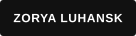
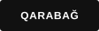
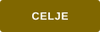
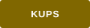

# Football Team Badges

Reusable, text-only club badges for GitHub profiles and READMEs. League badges use Shields.io, while the European competition section also includes standalone SVG files. Each badge uses only the club name and one recognizable club-color background; none uses an official logo, crest, or crest-like artwork. The preview links to the club's official website. The [badge catalogue repository](https://github.com/brandonwilliams33/football-team-badges) is the source for these examples.

## Season and sources

The directory covers **2026–27 league membership as of 2026-09-29**. All five current-season competitions had started by the cutoff. Rosters are grouped by league and contain 20 Premier League clubs, 20 La Liga clubs, 20 Serie A clubs, 18 Bundesliga clubs, and 18 Ligue 1 clubs (96 total). The official league pages below are the membership references; these are season snapshots and are not a promise that future seasons will have the same clubs.

Color values are single-color approximations of each club's recognizable primary colors, darkened where needed for readable white badge text. The copyable Markdown retains the existing pattern of linking a badge to the club's official site.

## Premier League (England)

Source: [official Premier League table](https://www.premierleague.com/en/tables/premier-league).

| Club | Preview | Copy-paste Markdown |
| --- | --- | --- |
| Arsenal |  | `` |
| Aston Villa |  | `` |
| Bournemouth |  | `` |
| Brentford |  | `` |
| Brighton & Hove Albion |  | `` |
| Chelsea |  | `` |
| Coventry City |  | `` |
| Crystal Palace |  | `` |
| Everton |  | `` |
| Fulham |  | `` |
| Hull City |  | `` |
| Ipswich Town |  | `` |
| Leeds United |  | `` |
| Liverpool |  | `` |
| Manchester City |  | `` |
| Manchester United |  | `` |
| Newcastle United |  | `` |
| Nottingham Forest |  | `` |
| Sunderland |  | `` |
| Tottenham Hotspur |  | `` |

## La Liga (Spain)

Source: [official LALIGA EA SPORTS standings](https://www.laliga.com/en-GB/laliga-easports/standing).

| Club | Preview | Copy-paste Markdown |
| --- | --- | --- |
| Athletic Club |  | `` |
| Atlético de Madrid |  | `` |
| CA Osasuna |  | `` |
| Celta Vigo |  | `` |
| Deportivo Alavés |  | `` |
| Elche CF |  | `` |
| FC Barcelona |  | `` |
| Getafe CF |  | `` |
| Levante UD |  | `` |
| Málaga CF |  | `` |
| Rayo Vallecano |  | `` |
| RC Deportivo |  | `` |
| RCD Espanyol |  | `` |
| Real Betis |  | `` |
| Real Madrid |  | `` |
| Real Racing Club |  | `` |
| Real Sociedad |  | `` |
| Sevilla FC |  | `` |
| Valencia CF |  | `` |
| Villarreal CF |  | `` |

## Serie A (Italy)

Source: [official Lega Serie A standings](https://en.legaseriea.it/serie-a/standings).

| Club | Preview | Copy-paste Markdown |
| --- | --- | --- |
| Atalanta |  | `` |
| Bologna |  | `` |
| Cagliari |  | `` |
| Como 1907 |  | `` |
| Fiorentina |  | `` |
| Frosinone |  | `` |
| Genoa |  | `` |
| Inter |  | `` |
| Juventus |  | `` |
| Lazio |  | `` |
| Lecce |  | `` |
| Milan |  | `` |
| Monza |  | `` |
| Napoli |  | `` |
| Parma |  | `` |
| Roma |  | `` |
| Sassuolo |  | `` |
| Torino |  | `` |
| Udinese |  | `` |
| Venezia |  | `` |

## Bundesliga (Germany)

Source: [official Bundesliga table](https://www.bundesliga.com/en/bundesliga/table).

| Club | Preview | Copy-paste Markdown |
| --- | --- | --- |
| FC Augsburg |  | `` |
| FC Bayern Munich |  | `` |
| Borussia Dortmund |  | `` |
| Eintracht Frankfurt |  | `` |
| SV Elversberg |  | `` |
| 1. FC Köln |  | `` |
| SC Freiburg |  | `` |
| Hamburger SV |  | `` |
| TSG Hoffenheim |  | `` |
| Bayer 04 Leverkusen |  | `` |
| Borussia Mönchengladbach |  | `` |
| 1. FSV Mainz 05 |  | `` |
| SC Paderborn 07 |  | `` |
| RB Leipzig |  | `` |
| FC Schalke 04 |  | `` |
| VfB Stuttgart |  | `` |
| 1. FC Union Berlin |  | `` |
| SV Werder Bremen |  | `` |

## Ligue 1 (France)

Source: [official Ligue 1 standings](https://ligue1.com/en/competitions/ligue1/standings).

| Club | Preview | Copy-paste Markdown |
| --- | --- | --- |
| Angers SCO |  | `` |
| AJ Auxerre |  | `` |
| Stade Brestois 29 |  | `` |
| Le Havre AC |  | `` |
| Le Mans FC |  | `` |
| RC Lens |  | `` |
| Lille OSC |  | `` |
| FC Lorient |  | `` |
| Olympique Lyonnais |  | `` |
| Olympique de Marseille |  | `` |
| AS Monaco |  | `` |
| OGC Nice |  | `` |
| Paris FC |  | `` |
| Paris Saint-Germain |  | `` |
| Stade Rennais |  | `` |
| RC Strasbourg Alsace |  | `` |
| Toulouse FC |  | `` |
| ESTAC Troyes |  | `` |

These are text-only fan badges, not official club crests.

## European competitions

This section adds clubs from outside the five leagues above that appeared in the group stage or league phase of the UEFA Champions League, Europa League, or Conference League during the five completed seasons from **2021–22 through 2025–26**. Qualifying rounds are not included. Participation is based on the [Champions League](https://www.uefa.com/uefachampionsleague/history/), [Europa League](https://www.uefa.com/uefaeuropaleague/history/), and [Conference League](https://www.uefa.com/uefaconferenceleague/history/) season archives. Clubs are grouped by their domestic league. Each has a standalone SVG file under `badges/european-competitions/`; these are text-only badges in the same single-color style, not approximations of the clubs' official crests. Run `python3 scripts/generate_european_badges.py` to regenerate the SVGs and README entries.

### Primeira Liga (Portugal)

| Club | Preview | Copy-paste Markdown |
| --- | --- | --- |
| Benfica |  | `` |
| Braga |  | `` |
| Porto |  | `` |
| Sporting CP |  | `` |
| Vitória SC |  | `` |

### Eredivisie (Netherlands)

| Club | Preview | Copy-paste Markdown |
| --- | --- | --- |
| Ajax |  | `` |
| AZ Alkmaar |  | `` |
| Feyenoord |  | `` |
| PSV Eindhoven |  | `` |
| FC Twente |  | `` |

### Belgian Pro League (Belgium)

| Club | Preview | Copy-paste Markdown |
| --- | --- | --- |
| Royal Antwerp |  | `` |
| Club Brugge |  | `` |
| Cercle Brugge |  | `` |
| KAA Gent |  | `` |
| KRC Genk |  | `` |
| Union Saint-Gilloise |  | `` |

### Premiership (Scotland)

| Club | Preview | Copy-paste Markdown |
| --- | --- | --- |
| Celtic |  | `` |
| Heart of Midlothian |  | `` |
| Rangers |  | `` |

### Austrian Bundesliga (Austria)

| Club | Preview | Copy-paste Markdown |
| --- | --- | --- |
| LASK |  | `` |
| Red Bull Salzburg |  | `` |
| Rapid Wien |  | `` |
| Sturm Graz |  | `` |

### Süper Lig (Türkiye)

| Club | Preview | Copy-paste Markdown |
| --- | --- | --- |
| Beşiktaş |  | `` |
| Fenerbahçe |  | `` |
| Galatasaray |  | `` |
| İstanbul Başakşehir |  | `` |
| Sivasspor |  | `` |
| Trabzonspor |  | `` |

### Super League Greece (Greece)

| Club | Preview | Copy-paste Markdown |
| --- | --- | --- |
| AEK Athens |  | `` |
| Olympiacos |  | `` |
| Panathinaikos |  | `` |
| PAOK |  | `` |

### Swiss Super League (Switzerland)

| Club | Preview | Copy-paste Markdown |
| --- | --- | --- |
| Basel |  | `` |
| BSC Young Boys |  | `` |
| Lugano |  | `` |
| Servette |  | `` |

### Superliga (Denmark)

| Club | Preview | Copy-paste Markdown |
| --- | --- | --- |
| Brøndby IF |  | `` |
| FC Copenhagen |  | `` |
| FC Midtjylland |  | `` |
| Nordsjælland |  | `` |

### Ukrainian Premier League (Ukraine)

| Club | Preview | Copy-paste Markdown |
| --- | --- | --- |
| Dynamo Kyiv |  | `` |
| Shakhtar Donetsk |  | `` |
| Zorya Luhansk |  | `` |

### Czech First League (Czechia)

| Club | Preview | Copy-paste Markdown |
| --- | --- | --- |
| Jablonec |  | `` |
| Slavia Prague |  | `` |
| Slovácko |  | `` |
| Sparta Prague |  | `` |
| Viktoria Plzeň |  | `` |

### Ekstraklasa (Poland)

| Club | Preview | Copy-paste Markdown |
| --- | --- | --- |
| Jagiellonia Białystok |  | `` |
| Lech Poznań |  | `` |
| Legia Warsaw |  | `` |
| Raków Częstochowa |  | `` |

### SuperSport HNL (Croatia)

| Club | Preview | Copy-paste Markdown |
| --- | --- | --- |
| Dinamo Zagreb |  | `` |

### Serbian SuperLiga (Serbia)

| Club | Preview | Copy-paste Markdown |
| --- | --- | --- |
| Partizan |  | `` |
| Red Star Belgrade |  | `` |
| TSC Bačka Topola |  | `` |

### Cypriot First Division (Cyprus)

| Club | Preview | Copy-paste Markdown |
| --- | --- | --- |
| AEK Larnaca |  | `` |
| Omonia |  | `` |
| Pafos FC |  | `` |

### Israeli Premier League (Israel)

| Club | Preview | Copy-paste Markdown |
| --- | --- | --- |
| Hapoel Be'er Sheva |  | `` |
| Maccabi Haifa |  | `` |
| Maccabi Tel Aviv |  | `` |

### Nemzeti Bajnokság I (Hungary)

| Club | Preview | Copy-paste Markdown |
| --- | --- | --- |
| Ferencváros |  | `` |

### Azerbaijan Premier League (Azerbaijan)

| Club | Preview | Copy-paste Markdown |
| --- | --- | --- |
| Qarabağ |  | `` |

### Kazakhstan Premier League (Kazakhstan)

| Club | Preview | Copy-paste Markdown |
| --- | --- | --- |
| Astana |  | `` |
| Kairat Almaty |  | `` |

### Slovak First Football League (Slovakia)

| Club | Preview | Copy-paste Markdown |
| --- | --- | --- |
| Slovan Bratislava |  | `` |
| Spartak Trnava |  | `` |

### Slovenian PrvaLiga (Slovenia)

| Club | Preview | Copy-paste Markdown |
| --- | --- | --- |
| Celje |  | `` |
| Maribor |  | `` |
| Olimpija Ljubljana |  | `` |

### Bulgarian First League (Bulgaria)

| Club | Preview | Copy-paste Markdown |
| --- | --- | --- |
| CSKA Sofia |  | `` |
| Ludogorets Razgrad |  | `` |

### Eliteserien (Norway)

| Club | Preview | Copy-paste Markdown |
| --- | --- | --- |
| Bodø/Glimt |  | `` |
| Molde |  | `` |

### Allsvenskan (Sweden)

| Club | Preview | Copy-paste Markdown |
| --- | --- | --- |
| Djurgården |  | `` |
| Elfsborg |  | `` |
| Häcken |  | `` |
| Malmö FF |  | `` |

### Liga I (Romania)

| Club | Preview | Copy-paste Markdown |
| --- | --- | --- |
| CFR Cluj |  | `` |
| FCSB |  | `` |

### League of Ireland Premier Division (Republic of Ireland)

| Club | Preview | Copy-paste Markdown |
| --- | --- | --- |
| Shamrock Rovers |  | `` |
| Shelbourne |  | `` |

### Veikkausliiga (Finland)

| Club | Preview | Copy-paste Markdown |
| --- | --- | --- |
| HJK Helsinki |  | `` |
| KuPS |  | `` |

### Moldovan Super Liga (Moldova)

| Club | Preview | Copy-paste Markdown |
| --- | --- | --- |
| Petrocub Hîncești |  | `` |
| Sheriff Tiraspol |  | `` |

### Latvian Higher League (Latvia)

| Club | Preview | Copy-paste Markdown |
| --- | --- | --- |
| RFS |  | `` |

### Besta deild karla (Iceland)

| Club | Preview | Copy-paste Markdown |
| --- | --- | --- |
| Breiðablik |  | `` |

### Armenian Premier League (Armenia)

| Club | Preview | Copy-paste Markdown |
| --- | --- | --- |
| Noah |  | `` |

### Premier League of Bosnia and Herzegovina (Bosnia and Herzegovina)

| Club | Preview | Copy-paste Markdown |
| --- | --- | --- |
| Zrinjski Mostar |  | `` |

### A Lyga (Lithuania)

| Club | Preview | Copy-paste Markdown |
| --- | --- | --- |
| Žalgiris Vilnius |  | `` |

### Premier League (Russia)

| Club | Preview | Copy-paste Markdown |
| --- | --- | --- |
| Lokomotiv Moscow |  | `` |
| Spartak Moscow |  | `` |
| Zenit Saint Petersburg |  | `` |
